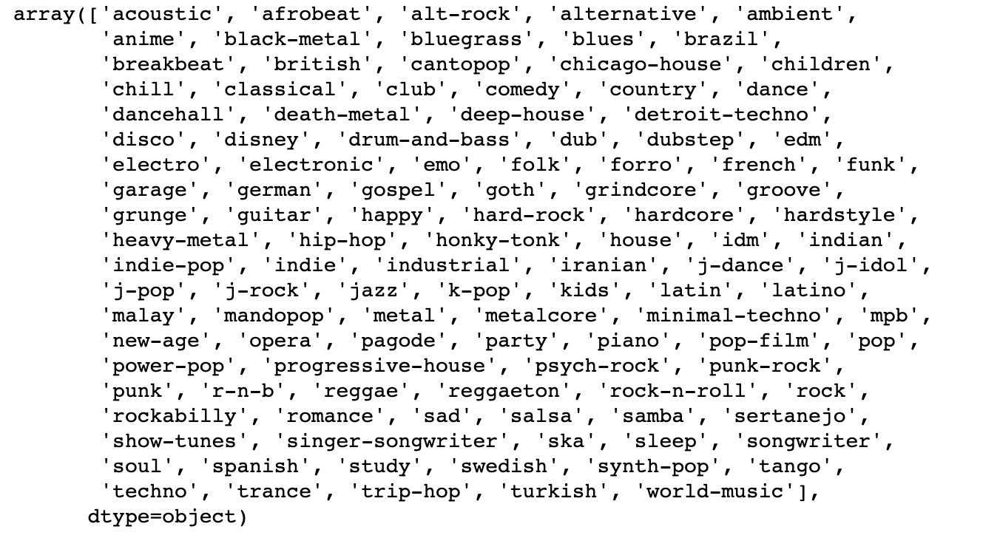
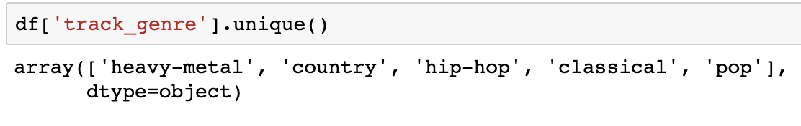

# DS_Foundations_Final_Project

## Introduction
  The objective of this project was to see if we can predict genre of a song from different measures like acousticness, danceability, tempo, and many other features. In this project, we use different machine learning supervised classification algorithms to see how accurately we can predict genre from the different measures in the dataset. This project uses a dataset from downloaded from kaggle that has over 113,000 datapoints. 

## Selection of Data

The model processing and training are conducted in the same Jupyter Notebook ( insert link).

The data has over 113,000 datapoints with 19 different features: track_id, artists, album_name, track_name, popularity, duration_ms, explicit, danceability, energy, key, loudness, mode, speechiness, acousticness, instrumental, liveness, valence, tempo, and time_signature. The objective of this project is to see if we can use these features to predict track_genre of a song. Dataset can be found from kaggle (insert kaggle info). 

When selecting the data, all NaN values were dropped from the dataset to avoid any problems. The features track_id, artists, album_name, track_name, and explicit were dropped from the dataframe as these features will not be helpful in predicting genre. 

After seeing exactly how many different genres there were in this dataset the decision was made to pick only 5 out of the 114 genres. 

INSERT PIC FROM .unique()

Going forward, the 5 genres that were looked at were heavy-metal, pop, country, hip-hop, and classical. This resulted in us having 5000 samples to work with. Since all of the genres were grouped together in the dataframe, a decision was made to shuffle the dataframe in case the test_train_split did not pick randomly enough. 

## Methods
Tools:
* Numpy, Pandas, Scikit for data analysis and inference. 
* Seaborn and Matplotlib for visualizations

Models used in Scikit-learn:
*Random Forest Classifier
*Support Vector Classifier
*Gradient Boosting Classifier

Hyperparameter Tuning from Scikit-learn:
GridSearchCV
RandomSearchCV

Metrics used from Scikit-learn:
Accuracy Score
Confusion Matrix

## Results

Random Forest Classifier:

insert pic

Support Vector Classifier:

insert pic

Gradient Boosting Classifier:

insert pic

After the initial model testing, the two with the highest accuracy scores, and were close in score, were Random Forest and Gradient Boosting. We proceed next with looking at how we could adjust these parameters to allow for a higher accuracy score with these two models. The first method that is used is GridSearchCV. 

Python Function:
insert pic

Random Forest:
insert pic

Gradient Boosting:

Insert pic

These results from GridSearchCV were about the same as our initial results. GridSearchCV seemed to be very time consuming when inputting lots of parameters, I wanted to try out RandomSearchCV with more hyperparameters.

Python Function:
insert pic

Random Forest:
insert pic

Gradient Boosting:
insert pic

Gradient

## Discussion
The model that performed the best without hyperparameter tuning was (insert). The model with the lowest accuracy score was Support Vector Classifier with an accuracy score of (insert). After deciding to continue with Random Forest Classifier and Gradient Boosting Classifier, the scores from the GridSearch were (insert scores), respectively. Noticing there was not much difference in scores from the initial testing, RandomSearchCV was explored to see if more hyperparamters could be used. The results from the hyperparamters for Random Forest Classifier was insert score, and thebest parameters were insert params. 
The results from the RandomSearch for Gradient Boosting Classifier were insert score and params. Looking at the different features in this data set like acousticness and danceability, we can determine that these feature do in fact have the ability to predict the genre of the song. 

## Summary

## References
