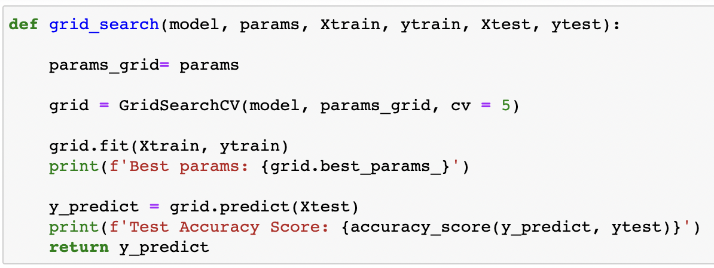
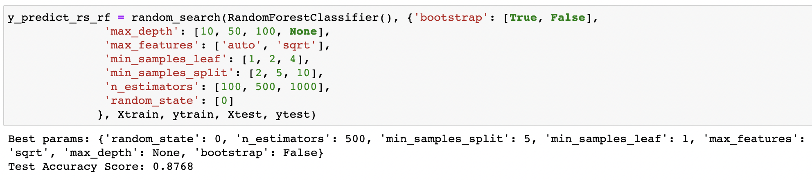

# DS_Foundations_Final_Project

## Introduction
  The objective of this project was to see genre of a song can be predicted from different measures like acousticness, danceability, tempo, and many other features. In this project, different supervised classification algorithms are used to see how accurately genre can be predicted from the different measures in the dataset. After the initial analysis, hyperparameter tuning using GridSearchCV and RandomSearch CV is conducted to see if the accuracy score can increase.
  

## Selection of Data

The model processing and training are conducted in the same Jupyter Notebook which can be found [here](https://github.com/doironm1ATWIT/DS_Foundations_Final_Project/blob/main/MeganDoiron_DS_Foundations_Project.ipynb).
This project uses a dataset that is downloaded from [Kaggle](https://www.kaggle.com/datasets/maharshipandya/-spotify-tracks-dataset/code)[1].

The data has over 113,000 datapoints with 19 different features: 
* track_id 
* artists 
* album_name 
* track_name 
* popularity
* duration_ms
* explicit 
* danceability
* energy
* key 
* loudness
* mode
* speechiness 
* acousticness 
* instrumental 
* liveness
* valence
* tempo
* time_signature 

The objective of this project is to see if the usee these features can predict track_genre of a song. 

When selecting the data, all NaN values were dropped from the dataset to avoid any problems. The features track_id, artists, album_name, track_name, and explicit were dropped from the dataframe as these features will not be helpful in predicting genre. 

After seeing exactly how many different genres there were in this dataset the decision was made to pick only 5 out of the 114 genres. 

Going forward, the 5 genres that were looked at were heavy-metal, pop, country, hip-hop, and classical. This resulted in us having 5000 samples to work with. Since all of the genres were grouped together in the dataframe, a decision was made to shuffle the dataframe in case the test_train_split did not pick randomly enough. 

Since this data has labels (track_genre) assigned and the labels are discrete, we will be using supervised classification machine learning models to determine the hypothesis.

## Methods
Tools:
* Numpy, Pandas, Scikit for data analysis and inference. 
* Seaborn and Matplotlib for visualizations

Models used in Scikit-learn:
*Random Forest Classifier
*Support Vector Classifier
*Gradient Boosting Classifier

Hyperparameter Tuning from Scikit-learn:
GridSearchCV
RandomSearchCV

Metrics used from Scikit-learn:
Accuracy Score
Confusion Matrix

## Results

Python Function:

The following models used the test-train-split, with 25 percent of the data being in the test set and random_state of 0. 

Random Forest Classifier:

Random Forest ended up having a test accuracy score of about 87.5 percent. The train accuracy score on the model is about 98.4 percent. Since the test accuracy score is close to the train accuracy score, this tells us that random forest is a good model to use for this problem. Looking at the heatmap, we can also see that this model did well with predicting our true values. 

Support Vector Classifier:

Support Vector Classifier had a test accuracy score of about 37.5 percent. The training accuracy score is about 36.1. Since our training accuracy score is very low as well, we can determine that Support Vector Classifier will not be a good model for this data.

Gradient Boosting Classifier:

Gradient Boosting Classifier has a test accuracy score of about 86.7 percent. The training accuracy score is about 94.5 percent. This is a good model for us to use due to the test accuracy score being close to the training accuracy score, and the fact that the training data was predicting about 94.5 percent of the genres.

After the initial model testing, the two with the highest accuracy scores, and were close in score, were Random Forest and Gradient Boosting.
Next, hyperparameter tuning will be used to look at how we could adjust these parameters to allow for a higher accuracy score with these two models. The first method that is used is GridSearchCV. 

Python Function:

This function allows for us to easily choose a different model with different hyperparameters to eliminate repetitive code. 

Random Forest:

After implementing GridSearchCV for hyperparameter testing, we can see that the accuracy score using the Random Forest Model is at 87.6. This accuracy score comes from using the following hyperparameters:
* max_depth = 30
* min_samples_split = 5
* n_estimators = 300
* random_state = 0

Gradient Boosting:

After implementing GridSearchCV using the Gradient Boosting Model the test accuracy score is about 86.7 percent. This score is determined with the following hyperparameters:
* learning_rate = 0.5
* min_samples_split = 5
* n_estimators = 100
* random_state = 0

These results from GridSearchCV were about the same as our initial results. GridSearchCV seemed to be very time consuming when wanting to look at many hyperparameters so, I wanted to try out RandomSearchCV with more hyperparameters to see if these accuracy scores could increase.

Python Function:

The following function is similar to the GridSearchCV function.

Random Forest:

After conducting the Random Forest Classifier on a RandomSearch for hyperparameters, the test accuracy is 87.7 percent with the 
best hyperparameters being:
* random_state = 0
* n_estimators = 500
* min_samples_split = 5
* min_samples_leaf = 1
* max_features = sqrt
* max_depth = None
* bootstrap = False

Gradient Boosting:

After conducting the Gradient Boost Classifier on a RandomSearch for hyperparameters, the test accuracy is about 86.5 with the 
best hyperparameters being:
* random_state = 0
* n_estimators = 500
* min_samples_split = 10
* min_sample_leaf = 2
* max_features = auto
* learning_rate = 0.5

## Discussion
  The model that performed the best without hyperparameter tuning was Random Forest with an accuracy score of 87.5 percent. The model with the lowest accuracy score was Support Vector Classifier with an accuracy score of 37.5. The decision was made to go with Gradient Boosting and Random Forest Classifiers because both of their accuracy scores were similar, with Random Forest being 87.5 percent accurate on the test set and Gradient Boosting being 86.7 percent accurate.
  
  After running these models with some hyperparameter tuning using GridSearchCV, the Random Forest model 87.6. The Random Forest model increased it's accuracy by 0.1 percent. The Gradient Boosting accuracy from GridSearchCV was 86.7. This accuracy stayed the same after hyperparameter tuning.
  
  Noticing there was not much difference in scores from the initial testing and due to GridSearchCV being very slow in calculating the best parameters, RandomSearchCV was explored to see if we could achieve a higher accuracy score. The accuracy from the hyperparameters for Random Forest Classifier was 87.6 and the accuracy score for Gradient Boosting is 86.5. Random Forest Classifier test accuracy using RandomSearch is the same score from when GridSearchCV was used. Gradient Boosting's accuracy decreased by 0.1 percent using Random Search. 

 The model that had the highest accuracy in predicting genre in our dataset was Random Forest with a accuracy of 87.6 percent after hyperparameter tuning. 

 For future research, I would like to look into predicting popularity in this dataset to see if genre, or any of the other features will contribute to the popularity value. 

## Summary
  
This project looks at different ways to measure music (acousticness, dancibility, tempo, etc.) and inputs these features into different models to see if these measures can predict genre. With the use of these two different models, Random Forest and Gradient Boosting, we can in fact predict genre using acousticness, danceability, tempo, etc. So, the music genre country does in fact have a different acousticness value than a heavy-metal song. The best model used in this experiment was Random Forest with an accuracy score of 87.6 after hyper parameter tuning. The other finding is that we recieved similar accuracy scores when using GridSearchCV and RandomSearchCV, but GridSearchCV takes longer to run since it is looking at every combination of hyperparameter. 

## References
[1] [Kaggle Dataset](https://www.kaggle.com/datasets/maharshipandya/-spotify-tracks-dataset/code)

